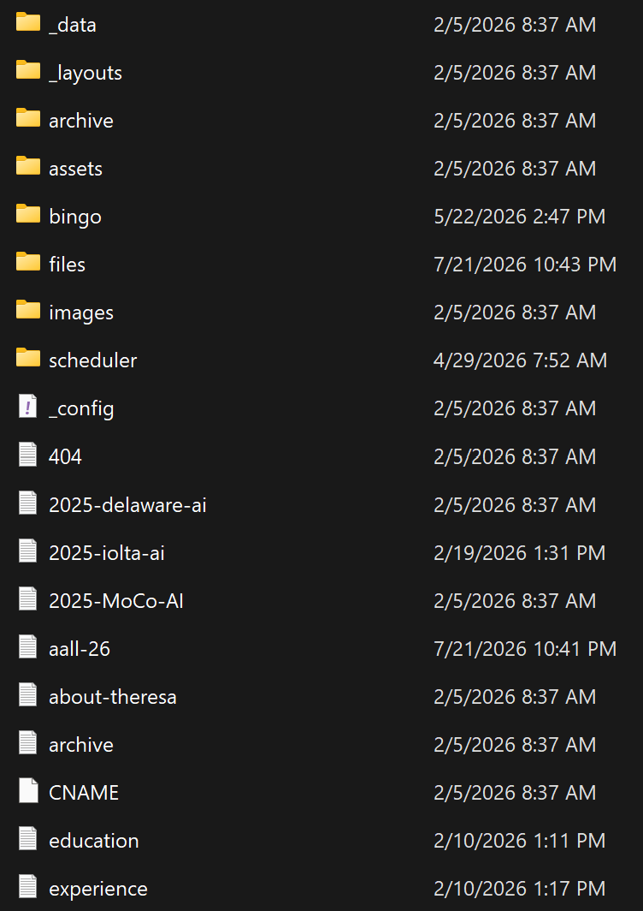
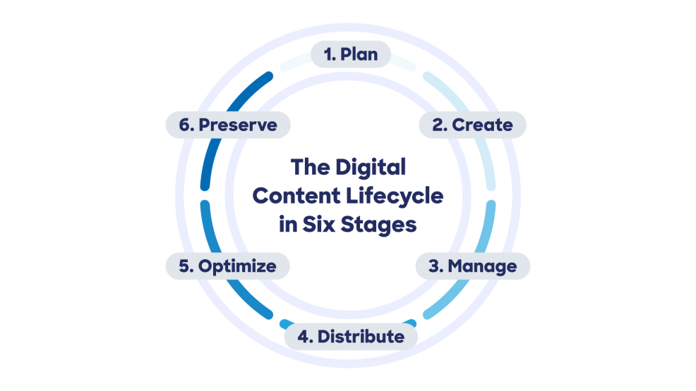
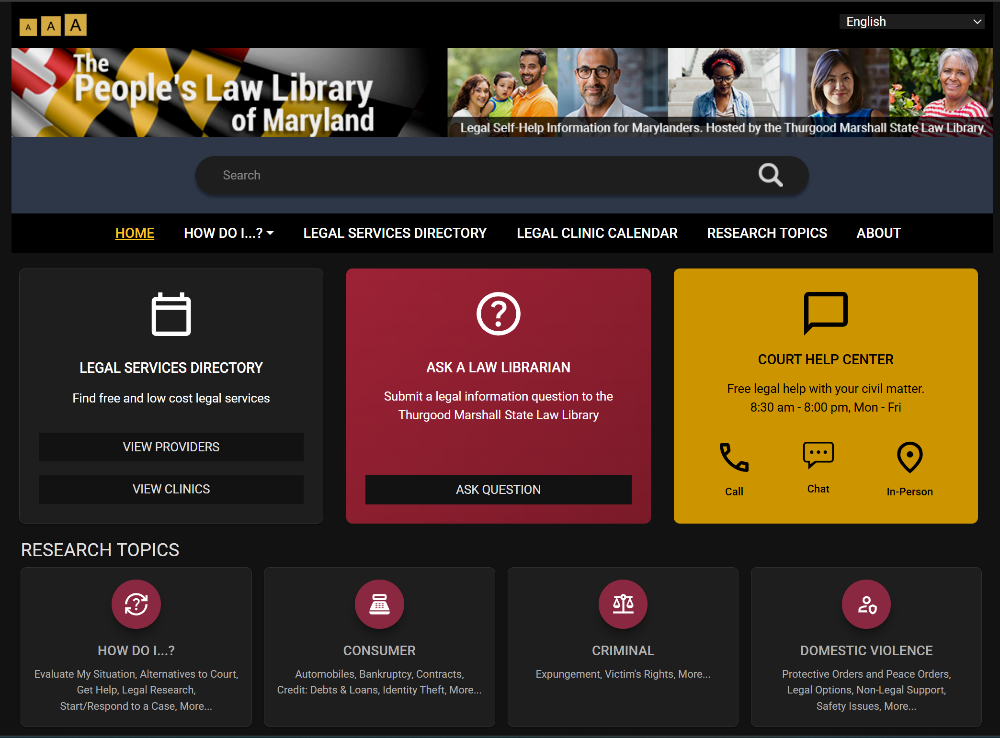

## Who am I?

- Head of Web Content and Services at [Maryland's Thurgood Marshall State Law Library](https://mdcourts.gov/lawlib)
- Manage [People's Law Library](https://www.peoples-law.org) legal information website
- [More about me](https://sampson.info/leland)

## Why a content management system?

:::: {.columns}

::: {.column width="65%"}
- Information changes constantly.
- Static sites are not interactive.
- Static sites quickly become unmanageable.

**Takeaway:** A CMS is an ongoing organizational system.
:::

::: {.column width="35%"}
{width="80%"}
:::

::::

## What is a web content management system?

:::: {.columns}

::: {.column width="50%"}
A CMS coordinates:

- Content
- People
- Workflows
- Presentation
:::

::: {.column width="50%"}
> **Definition:** A system for creating, organizing, publishing, and maintaining web content.
:::

::::

## A CMS is not the same as

- a library website.
- an online catalog.
- a discovery interface.

**One ecosystem, different functions.**

## One ecosystem, different functions

| System | Main job |
|---|---|
| CMS | Manage web content |
| Website | Explain how to use library |
| Catalog | Find library materials |
| Discovery interface | Search across resources |

## Content Life Cycle

{width="72%"}

::: {.source}
[Source: Acquia, “Content Lifecycle”](https://www.acquia.com/glossary/content-lifecycle)
:::

## PLL Content Life Cycle {.center-content}

1. Plan 
2. Create 
3. Optimize
4. Distribute 
5. Manage 
6. Preserve 

## What users actually experience

Users do not see the CMS. They see:

- Navigation
- Page structure
- Content

**A good user interface distills complex systems into a simple, intuitive experience**

## Responsive design

Content should adapt to:

- Phones
- Tablets
- Desktops

**Goal:** Preserve clarity while the layout changes.

## Bento-box interfaces

Distinct panels can organize different user needs:

- Search
- Physical location info
- Events
- Research help

**Purpose:** Visual grouping should speed navigation.

## Bento-box interfaces

{width="96%"}

## Why organizations adopt a CMS

- Distributed authoring
- Consistent design
- Faster updates
- Reusable content
- Easier maintenance

## What a CMS cannot automatically solve

- Content governance
- Effective communication
- Poor workflows
- Training needs

**A CMS reflects organizational values and priorities.**

## So much more!

- Picking a CMS 
- Or migrating CMS 
- Governance 
- Documentation
- Accessibility 
- Preservation 

## The elephant in the room

- [People's Law AI use policy](https://www.peoples-law.org/volunteer-writing-guide#use-of-ai-features-and-tools)

1. **Plan**
   - AI systems are helpful discovery tools

2. **Creation**
   - [Gemini Notebook](https://notebook.google/) for outlines and citations
   - [Lex.page](https://lex.page/) for draft improvement
   - **All published words are written by humans**

## The elephant in the room

3. **Managing**
   - Custom software to find new law (vibe coding)
   - Comparing existing articles to new law

4. **Distribute**
   - Search behaviors are changing
   - Measures of impact are changing

## Conclusion

1. A CMS is a publishing tool **and** an organizational system.
2. Effective user experience and accessibility distill complexity into simple UI/UX.
3. Going forward, not all users are human. 

**Theme inspiration:** [Anything But Binary](https://anythingbutbinary.com/)  

**AI helped make this presentation**
